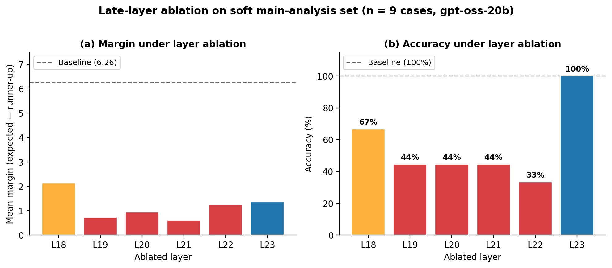
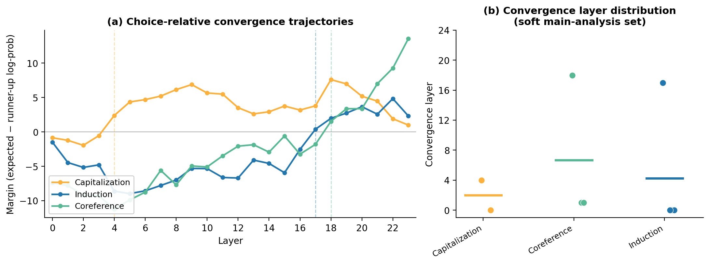
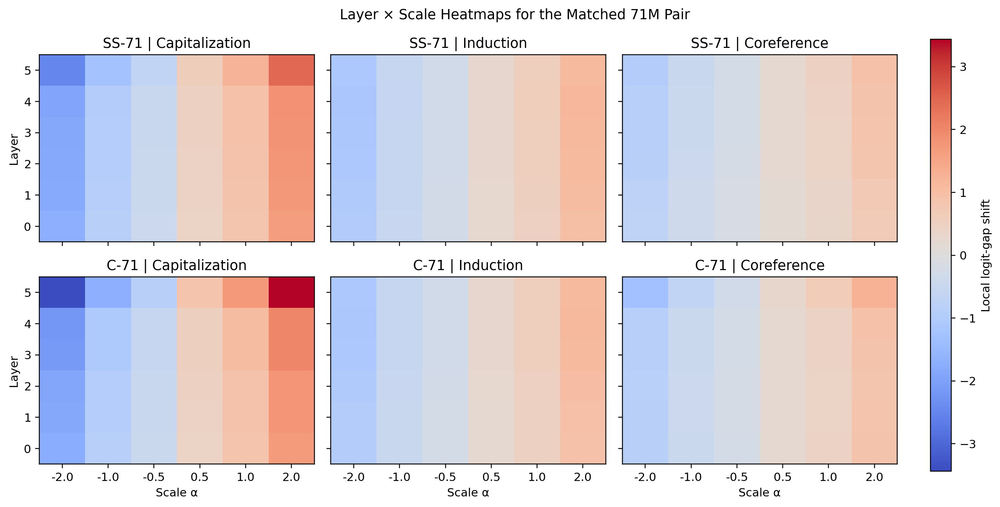
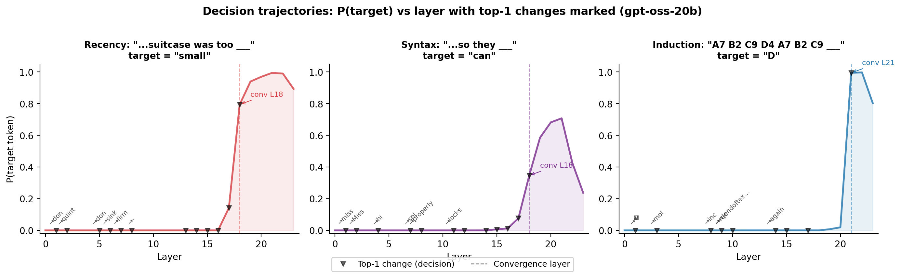
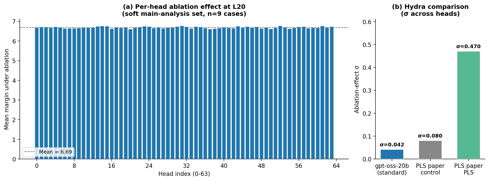
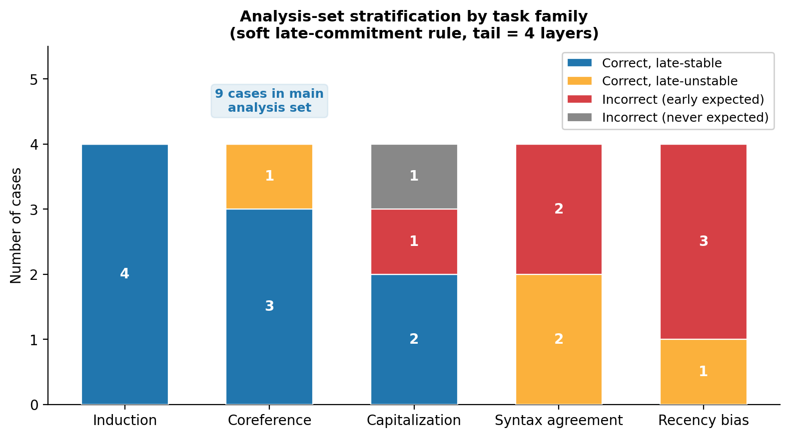

# gpt-oss-interp

## Context

This repository is the **production-scale validation** half of a two-part research program on mechanistic interpretability.

The first part, developed across three preprints ([inspectable internals via stream separation](https://arxiv.org/abs/2603.07461), [head specialization via per-layer supervision](https://arxiv.org/abs/2603.18029), [preserving specialization into late layers via delayed integration](https://arxiv.org/abs/2603.07482)), demonstrates at controlled scale (22M–53M parameters) that architectural constraints — dual-stream decomposition, per-layer supervision, gated attention — make transformer internals causally inspectable. The core finding is that per-layer supervision breaks the Hydra effect, exposing 5–23x larger ablation effects and enabling 4x greater steering control than standard-trained models.

This repository takes the **same inspection toolkit** — causal intervention benchmarks, per-layer logit-lens readouts, direct-vocabulary steering, activation capture — and applies it to OpenAI's **gpt-oss-20b** (21B params, 3.6B active), a production MoE transformer trained without any interpretability constraints. The goal is to answer: do the measurement methods transfer, and what do they reveal about a standard model at scale?

The steering experiments (threads 6–8) additionally use companion Dual-Stream Transformer (DST) models from the preprint work, where architectural structure enables cleaner steering demonstration:

| Label | Architecture | Mixing | Params | Description |
|-------|-------------|--------|-------:|-------------|
| DST-baseline | Single-stream dense | dns-dns/dns-dns | 71M | Standard transformer baseline (no stream separation) |
| DST-cascade | CASCADE dual-stream | dns-dns/dns-dns + gated attention | 71M | Dual-stream with frozen symbolic stream; attention output cascades into FFN |
| DST-independent | Fully independent channels | ind-ind/ind-ind | 22M | Complete channel isolation — maximum interpretability |

The mixing signature `attn-attn/ffn-ffn` describes how heads share information at four mixing points (attention value, attention output, FFN up-projection, FFN down-projection): `dns` = dense (standard), `ind` = independent (no cross-head mixing).

## Key Findings

### 1. Late-layer ablation reveals critical computation at L19-L21

Ablating individual layers on the 9-case soft main-analysis set shows that layers 19-21 are where gpt-oss-20b resolves task-relevant behavior:



Layers 19-21 ablation drops accuracy from 100% to 44% and collapses margin by 85-90%. Layer 23 ablation preserves accuracy (100%) despite margin loss, suggesting it refines rather than decides.

### 2. Task-dependent convergence: different behaviors converge at different depths

Per-layer logit-lens readouts with choice-relative convergence show task-specific convergence patterns:



- **Capitalization**: converges early (L1-2), minimal depth processing
- **Coreference**: converges mid-depth (L5), requires semantic resolution
- **Induction**: converges late (L17+), consistent with induction heads as a late-layer phenomenon

### 3. Structural induction survives noise — the model extracts pattern, not memorized sequence

Standard induction benchmarks use sequences like "sun moon star sun moon star sun moon ___" — but these could be memorized from training data. We test with arbitrary tokens that cannot plausibly appear as a memorized sequence:

**Clean structural induction**: `D 5 Z 7 B 2 D 5 Z 7 B 2 D 5 Z 7 B ___`
- Core pattern: `D 5 Z 7 B 2` repeats 3 times. After "B ", the model predicts **"2"** (converges at L19).

**Noisy structural induction**: `D 5 Z 7 B 2 D 5 A 7 B 2 D 5 W 7 B 2 D 5 X 7 B 2 D 5 Y 7 B 2 D 5 Q 7 B 2 D 5 R ___`
- Core pattern: `7 B 2 D 5 [letter]` — the letter changes each cycle (Z, A, W, X, Y, Q, R) while the rest repeats. After "R ", the model predicts **"7"** (converges at L20).

The model extracts the stable structural regularity `7 B 2 D 5` despite the varying letter. This is genuine in-context pattern recognition — not retrieval of a memorized sequence. The noisy case requires one additional layer to converge (L20 vs L19), reflecting the extra computation needed to distinguish structure from noise.

This result connects to two lines of work. First, Olsson et al. (2022) identified **induction heads** as specific attention circuits that implement match-and-copy behavior, forming through a phase transition in middle-to-late layers — consistent with our observation that structural induction requires deep processing (L19–L20) while simpler tasks like capitalization resolve at L1–2. Second, recent architectural work has shown that early transformer layers primarily perform memorization-like retrieval rather than genuine computation: DeepSeek's **Engram module** (2025) replaces early FFN layers with O(1) hash-based n-gram lookup with no loss in model quality, validating that early layers can be externalized as non-parametric memory. The contrast is stark: the early-layer tasks that Engram can replace (pattern recall, factual retrieval) converge at L1–5 in our logit-lens analysis, while the structural computation that *cannot* be replaced by lookup (noisy induction) converges at L19–L20.

### 4. Direct-vocabulary steering works with positional specificity

Exact vocabulary-space directions (`W[token_A] - W[token_B]`) applied in the contextual stream at late layers cleanly flip model answers:



Crucially, the effect is **position-specific**: steering at the decision-token position flips answers; identical steering at token 0 produces zero effect. This rules out diffuse perturbation artifacts.

### 5. Decision trajectories reveal self-supervised steering directions

Each layer where the model's top-1 prediction changes is a "decision point." The logit-space difference at decision layers is a self-supervised steering direction — the model tells you what decision it made, at which layer:



Example decision arc for recency-bias position 12 ("suitcase was too ___"):
```
L0: noise → L8: '‑' → L13: 'pack' → L14: <eos> → L16: '(' → L17: 'too' → L18: 'small'
```

This is fundamentally different from contrastive activation addition (CAA), which requires 100+ curated positive/negative example pairs. CASCADE reads steering directions directly from the model's own computation.

### 6. Per-head Hydra measurement confirms distributed redundancy

Ablating each of 64 heads individually at L20 produces near-identical margins (σ = 0.042) — the model barely notices losing any single head:



gpt-oss-20b's σ = 0.042 is **half** the PLS-paper control (σ = 0.08) and **11× smaller** than PLS-trained models (σ = 0.47). This directly validates the Hydra hypothesis at production scale: standard training produces extreme distributed redundancy, which per-layer supervision breaks.

### 7. Honest analysis-set stratification

Not all benchmark cases support clean mechanistic claims. A 4-way stratification separates cases by convergence stability:



Only 9/20 cases (45%) are "correct, late-stable" — the main analysis set. Recency bias and syntax agreement largely fail. This is a feature, not a bug: it tells you where the model's behavior is robust enough for causal claims.

### 8. CASCADE feasibility validated

The gauge-safe pseudoinverse CASCADE target (`x_e* = (CW)⁺ · C(log p - Wx_t)`) reconstructs teacher distributions with:

| Prompt | Relative residual | KL divergence |
|--------|------------------:|-------------:|
| Recency ("small") | 0.0029 | 1.2e-5 |
| Syntax ("can") | 0.0029 | 8.9e-5 |
| Induction ("D") | 0.0030 | 1.2e-4 |

In the same-model setting, the centered least-squares target is numerically excellent. This validates the mathematical machinery before attempting cross-vocabulary distillation.

### 9. MXFP4 quantization-interpretability tradeoff

MXFP4 fused kernels bypass Python-level forward hooks on the router module. Router introspection is opaque under quantization — expert masking operates at the MLP output level, not gate-level. This is a concrete example of the quantization-interpretability tradeoff: compression techniques that fuse operations reduce the surface area for mechanistic inspection.

## Architecture Target

**gpt-oss-20b** (`GptOssForCausalLM`): 24-layer MoE transformer.

| Component | Detail |
|-----------|--------|
| Attention | 64 GQA query heads, 8 KV heads, head_dim=64 |
| Pattern | Alternating sliding (128-token window) / full attention |
| MoE | 32 experts, top-4 routing, SwiGLU |
| Position | RoPE with YaRN scaling (131K context) |
| Vocab | 201,088 tokens (o200k_harmony BPE) |
| Quantization | MXFP4 on expert weights; attention and router in bf16 |

## Quick Start

```bash
# Install
pip install -e .
pip install kernels   # MXFP4 support

# Download model (~13 GB)
huggingface-cli download openai/gpt-oss-20b

# Smoke test (no GPU needed)
python scripts/run_benchmark.py --config configs/dry_run_recency.py

# Run tests
pytest tests/

# Intervention benchmark on real model
python scripts/run_benchmark.py --config configs/head_ablation_L20.py

# Logit-lens analysis
python threads/solid/1-convergence-logit-lens/run_logit_lens.py \
    --model openai/gpt-oss-20b \
    --prompt "The trophy would not fit in the suitcase because the suitcase was too" \
    --output runs/logit_lens_demo/

# Feature extraction
python threads/in-progress/9-feature-extraction/run_feature_extraction.py \
    --model openai/gpt-oss-20b \
    --prompt "The trophy would not fit in the suitcase because the suitcase was too" \
    --output runs/features_demo/

# Generate figures from existing data (no GPU needed)
python scripts/generate_phase1_figures.py
python threads/solid/4-decision-trajectories/generate_decision_figure.py
```

## Research Threads

This project is organized as 14 research threads at three maturity levels. See **[THREAD_MAP.md](THREAD_MAP.md)** for the full index with links, run counts, and figures.

### Solid — completed results

| # | Thread | Model | Problem | Contribution | Impact |
|---|--------|-------|---------|--------------|--------|
| 1 | [Convergence](threads/solid/1-convergence-logit-lens/) | gpt-oss-20b | Where in the network does each task get resolved? | Applies logit lens (prior work) to a production MoE; measures task-dependent convergence depth | Locates computation by task type — prerequisite for targeted intervention |
| 2 | [Late-layer ablation](threads/solid/2-late-layer-ablation/) | gpt-oss-20b | Which layers are causally critical, not just correlated? | Standard ablation methodology applied at production MoE scale with attention-vs-MoE decomposition | Narrows the interpretability target from 24 layers to 3 (L19–21) |
| 3 | [Analysis set filtering](threads/solid/3-analysis-set-filtering/) | gpt-oss-20b | Which test cases support honest mechanistic claims? | Systematic 4-way stratification by convergence stability; not aware of prior systematic methodology for this in interpretability | Only 45% of cases pass — sets defensible scope for all downstream threads |
| 4 | [Decision trajectories](threads/solid/4-decision-trajectories/) | gpt-oss-20b | Can the model's own prediction changes serve as steering directions? | Extracts logit-space directions from prediction-transition layers; not aware of prior work using these as self-supervised steering signals | Provides steering directions without curated contrastive pairs; empirical basis for CASCADE |
| 5 | [Hydra / head redundancy](threads/solid/5-hydra-head-redundancy/) | gpt-oss-20b | Are individual attention heads specialized or redundant? | Measures the Hydra effect (from companion PLS preprint) at 21B-param production scale | σ=0.042 confirms extreme redundancy — explains why circuit-level interpretation is hard in standard models |
| 6 | [Direct vocab steering](threads/solid/6-direct-vocab-steering/) | DST-baseline, DST-cascade | Can exact vocabulary directions flip model answers with positional precision? | Uses raw `W[A]−W[B]` unembedding directions for steering; not aware of prior work using exact vocabulary differences (vs learned directions) | Position specificity distinguishes targeted intervention from diffuse perturbation |
| 7 | [Channel probing](threads/solid/7-channel-probing/) | DST-cascade | Which hidden-state dimensions carry the steering signal? | Per-channel causal analysis: probe-promoted channels (H4) do not predict causal importance (H2, H5); Spearman = -0.363 on induction | Probing identifies readout-correlated channels; causal intervention reveals computation-driving channels — these are different |
| 8 | [Selectivity](threads/solid/8-selectivity/) | DST-cascade | Does steering affect only the target behavior? | Cross-family comparison: recency channelized/whole ratio 0.80 (recency) vs 0.60 (induction) on same model | Recency steering signal is concentrated in few channels; induction is distributed — task-dependent steering granularity |
| 14 | [Bregman geometry](threads/solid/14-bregman-geometry/) | 4 matched 45.4M transformers | Are linear interpretability methods geometrically valid at intermediate layers? | Extends Park et al.'s output-layer Bregman analysis inward; 2x2 factorial (stream separation x aux. loss) | Standard transformers have effective rank 8/516 at intermediate layers — linear methods operate in 2% of the geometry; cosine diagnostic predicts steering validity |

### In progress — code and initial experiments exist

| # | Thread | Model | Problem | Contribution | Impact |
|---|--------|-------|---------|--------------|--------|
| 9 | [Feature extraction](threads/in-progress/9-feature-extraction/) | gpt-oss-20b | Can computational modes be captured as unified feature vectors? | 6,425D features across 555 tokens / 5 families; intrinsic dimension ranges from 20 (syntax) to 68 (coreference) | Task-dependent dimensionality — syntax is structured, coreference is distributed |
| 10 | [Bridge / cross-model](threads/in-progress/10-bridge-cross-model/) | gpt-oss-20b, Gemma-3-1B | Do these findings generalize beyond gpt-oss-20b? | Screening pipeline to evaluate new models for interpretability compatibility | Early infrastructure — one model (Gemma-3-1B) screened so far |

### Theoretical — framework documented, not yet implemented

Threads 11–13 (CASCADE distillation, geometric framework, attention path sensitivity) have theoretical specifications but incomplete or stub implementations. See [THREAD_MAP.md](THREAD_MAP.md) for details.

## Repository Structure

```
THREAD_MAP.md                    # Index of all 14 research threads
threads/                         # Thread-specific scripts, docs, and READMEs
  solid/                         # 9 publication-ready threads
  in-progress/                   # 2 threads with code but thin experiments
  theoretical/                   # 3 threads with frameworks but no implementation

gpt_oss_interp/                  # Shared Python package (~40 modules)
├── config.py                    # Dataclasses: tasks, interventions, benchmarks
├── backends/                    # Model execution (dry_run + real gpt-oss-20b)
├── benchmarks/                  # Task library (5 families, 36 cases), runner, pools
├── capture/                     # Activation and routing capture via hooks
├── features/                    # Feature extraction + geometry
├── readouts/                    # Per-layer logit-lens readouts
├── interventions/               # Intervention sweep expansion
├── steering/                    # Probing, causal analysis, selectivity
├── distillation/                # CASCADE workflows (stubs)
├── common/                      # Shared utilities (artifacts, I/O)
└── reports/                     # CSV, JSON, Markdown output

scripts/                         # Shared CLI tools (4 cross-thread scripts + one_off/)
configs/                         # 7 benchmark configurations
runs/                            # 52 experiment output directories
figures/                         # 16 publication-quality figures (PDF + PNG)
tests/                           # pytest suite
doc/references/                  # Literature reviews + academic papers
```

## Intervention Types

| Kind | Target | Mechanism |
|------|--------|-----------|
| `HEAD_MASK` | Attention heads | Scale specific GQA head outputs |
| `EXPERT_MASK` | MoE experts | Proportional MLP output scaling |
| `LAYER_SCALE` | Transformer blocks | Scale block delta (residual-preserving) |
| `TEMPERATURE_SCALE` | Attention | Scale attention logits |

## Companion Work

This toolkit validates at production scale the same ideas demonstrated at controlled scale in three preprints:

- [**The Dual-Stream Transformer**](https://arxiv.org/abs/2603.07461) — interpretability through stream separation (2.5% loss cost for full decomposition)
- [**Engineering Verifiable Modularity via Per-Layer Supervision**](https://arxiv.org/abs/2603.18029) — PLS + gated attention yields 5-23x larger ablation effects, exposing hidden modularity
- [**Interpretable-by-Design Transformers via Architectural Stream Independence**](https://arxiv.org/abs/2603.07482) — delayed position/semantic integration enables surgical intervention with 7x coreference advantage

## Design Principles

- **Results first**: `figures/` and `runs/` are the most prominent directories
- **Backend-agnostic benchmarks**: benchmark code never sees model internals
- **Config-driven experiments**: Python config files, not CLI flags
- **Hook-based inspection**: PyTorch forward hooks for capture and intervention
- **Document what doesn't work**: MXFP4 limitations are findings, not failures
- **Honest analysis sets**: filter cases by convergence stability before claiming mechanism
