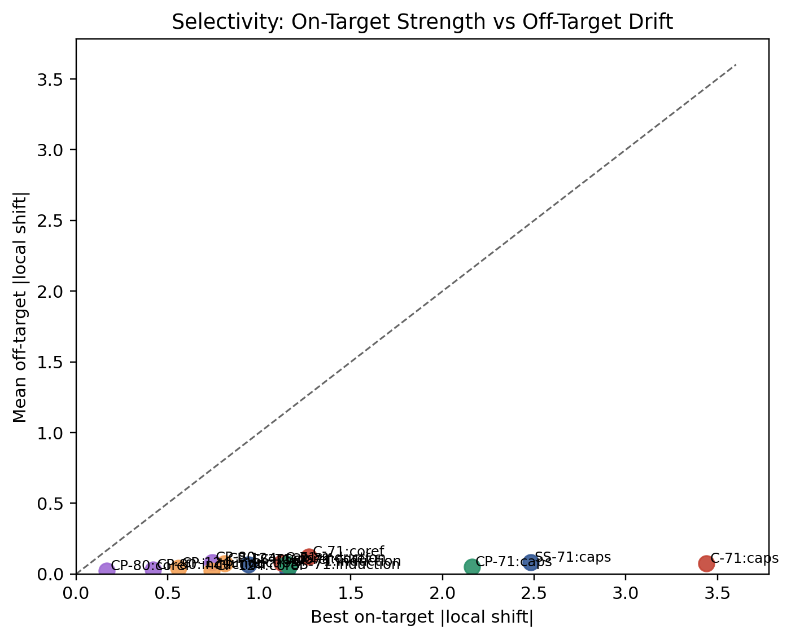

# gpt-oss-interp

Mechanistic interpretability toolkit for OpenAI's **gpt-oss-20b** (21B params, 3.6B active). Combines causal intervention benchmarks, per-layer logit-lens readouts, direct-vocabulary steering, and computational-mode feature extraction to study internal representations of a production-scale MoE transformer.

Companion to three March 2026 preprints on interpretable transformer architectures ([dual-stream](https://arxiv.org/abs/2603.07461), [per-layer supervision / Hydra effect](https://arxiv.org/abs/2603.18029), [late fusion](https://arxiv.org/abs/2603.07482)).

## Key Findings

### 1. Late-layer ablation reveals critical computation at L19-L21

Ablating individual layers on the 9-case soft main-analysis set shows that layers 19-21 are where gpt-oss-20b resolves task-relevant behavior:


Layers 19-21 ablation drops accuracy from 100% to 44% and collapses margin by 85-90%. Layer 23 ablation preserves accuracy (100%) despite margin loss, suggesting it refines rather than decides.

### 2. Task-dependent convergence: different behaviors converge at different depths

Per-layer logit-lens readouts with choice-relative convergence show task-specific convergence patterns:


- **Capitalization**: converges early (L1-2), minimal depth processing
- **Coreference**: converges mid-depth (L5), requires semantic resolution
- **Induction**: converges late (L17+), consistent with induction heads as a late-layer phenomenon

### 3. Direct-vocabulary steering works with positional specificity

Exact vocabulary-space directions (`W[token_A] - W[token_B]`) applied in the contextual stream at late layers cleanly flip model answers:




Crucially, the effect is **position-specific**: steering at the decision-token position flips answers; identical steering at token 0 produces zero effect. This rules out diffuse perturbation artifacts.

### 4. Decision trajectories reveal self-supervised steering directions

Each layer where the model's top-1 prediction changes is a "decision point." The logit-space difference at decision layers is a self-supervised steering direction — the model tells you what decision it made, at which layer:


Example decision arc for recency-bias position 12 ("suitcase was too ___"):
```
L0: noise → L8: '‑' → L13: 'pack' → L14: <eos> → L16: '(' → L17: 'too' → L18: 'small'
```

This is fundamentally different from contrastive activation addition (CAA), which requires 100+ curated positive/negative example pairs. CASCADE reads steering directions directly from the model's own computation.

### 5. Per-head Hydra measurement confirms distributed redundancy

Ablating each of 64 heads individually at L20 produces near-identical margins (σ = 0.042) — the model barely notices losing any single head:


gpt-oss-20b's σ = 0.042 is **half** the PLS-paper control (σ = 0.08) and **11× smaller** than PLS-trained models (σ = 0.47). This directly validates the Hydra hypothesis at production scale: standard training produces extreme distributed redundancy, which per-layer supervision breaks.

### 6. Honest analysis-set stratification

Not all benchmark cases support clean mechanistic claims. A 4-way stratification separates cases by convergence stability:


Only 9/20 cases (45%) are "correct, late-stable" — the main analysis set. Recency bias and syntax agreement largely fail. This is a feature, not a bug: it tells you where the model's behavior is robust enough for causal claims.

### 7. CASCADE feasibility validated

The gauge-safe pseudoinverse CASCADE target (`x_e* = (CW)⁺ · C(log p - Wx_t)`) reconstructs teacher distributions with:

| Prompt | Relative residual | KL divergence |
|--------|------------------:|-------------:|
| Recency ("small") | 0.0029 | 1.2e-5 |
| Syntax ("can") | 0.0029 | 8.9e-5 |
| Induction ("D") | 0.0030 | 1.2e-4 |

In the same-model setting, the centered least-squares target is numerically excellent. This validates the mathematical machinery before attempting cross-vocabulary distillation.

### 8. MXFP4 quantization-interpretability tradeoff

MXFP4 fused kernels bypass Python-level forward hooks on the router module. Router introspection is opaque under quantization — expert masking operates at the MLP output level, not gate-level. This is a concrete example of the quantization-interpretability tradeoff: compression techniques that fuse operations reduce the surface area for mechanistic inspection.

## Architecture Target

**gpt-oss-20b** (`GptOssForCausalLM`): 24-layer MoE transformer.

| Component | Detail |
|-----------|--------|
| Attention | 64 GQA query heads, 8 KV heads, head_dim=64 |
| Pattern | Alternating sliding (128-token window) / full attention |
| MoE | 32 experts, top-4 routing, SwiGLU |
| Position | RoPE with YaRN scaling (131K context) |
| Vocab | 201,088 tokens (o200k_harmony BPE) |
| Quantization | MXFP4 on expert weights; attention and router in bf16 |

## Quick Start

```bash
# Install
pip install -e .
pip install kernels   # MXFP4 support

# Download model (~13 GB)
huggingface-cli download openai/gpt-oss-20b

# Smoke test (no GPU needed)
python scripts/run_benchmark.py --config configs/dry_run_recency.py

# Run tests
pytest tests/

# Intervention benchmark on real model
python scripts/run_benchmark.py --config configs/head_ablation_L20.py

# Logit-lens analysis
python scripts/run_logit_lens.py \
    --model openai/gpt-oss-20b \
    --prompt "The trophy would not fit in the suitcase because the suitcase was too" \
    --output runs/logit_lens_demo/

# Feature extraction
python scripts/run_feature_extraction.py \
    --model openai/gpt-oss-20b \
    --prompt "The trophy would not fit in the suitcase because the suitcase was too" \
    --output runs/features_demo/

# Generate figures from existing data (no GPU needed)
python scripts/generate_phase1_figures.py
python scripts/generate_decision_figure.py
```

## Repository Structure

```
figures/                         # Publication-quality visualizations (9 figures)
tests/                           # pytest suite (52 tests)
runs/                            # 49+ experiment directories with artifacts

gpt_oss_interp/
├── config.py                    # Dataclasses: tasks, interventions, benchmarks
├── backends/
│   ├── base.py                  # Backend contract (score, intervene, clear)
│   ├── dry_run.py               # Synthetic backend for smoke testing
│   └── transformers_gpt_oss.py  # Real gpt-oss-20b backend with hooks
├── capture/
│   ├── activation_cache.py      # Hidden-state capture via forward hooks
│   └── router_capture.py        # MoE routing decision capture
├── features/
│   ├── extractor.py             # Extended Tier-2 feature extraction (~7,200D for MoE)
│   └── geometry.py              # Metric-space analysis of feature point clouds
├── readouts/
│   └── logit_lens.py            # Per-layer token prediction readouts
├── benchmarks/
│   ├── tasks.py                 # Task library (5 families, 36 cases)
│   ├── pools.py                 # Case filtering and analysis-set definitions
│   └── runner.py                # Benchmark orchestration and scoring
├── interventions/
│   └── specs.py                 # Intervention sweep expansion
├── steering/                    # Probing, readouts, steering controls
├── distillation/                # Teacher-student / CASCADE workflows
└── reports/
    └── writers.py               # CSV, JSON, Markdown output

scripts/                         # CLI tools (29 scripts)
configs/                         # Benchmark configurations
doc/                             # Theory, plans, and reports
  ├── reference/                 # GEOMETRIC_FRAMEWORK, CASCADE_DISTILLATION, etc.
  ├── reports/                   # 11 experiment reports
  ├── plans/                     # Research plans and specs
  └── memo/                      # Direct-vocab steering memo with figures
```

## Intervention Types

| Kind | Target | Mechanism |
|------|--------|-----------|
| `HEAD_MASK` | Attention heads | Scale specific GQA head outputs |
| `EXPERT_MASK` | MoE experts | Proportional MLP output scaling |
| `LAYER_SCALE` | Transformer blocks | Scale block delta (residual-preserving) |
| `TEMPERATURE_SCALE` | Attention | Scale attention logits |

## Companion Work

This toolkit validates at production scale the same ideas demonstrated at controlled scale in three preprints:

- [**The Dual-Stream Transformer**](https://arxiv.org/abs/2603.07461) — interpretability through stream separation (2.5% loss cost for full decomposition)
- [**Engineering Verifiable Modularity via Per-Layer Supervision**](https://arxiv.org/abs/2603.18029) — PLS + gated attention yields 5-23x larger ablation effects, exposing hidden modularity
- [**Interpretable-by-Design Transformers via Architectural Stream Independence**](https://arxiv.org/abs/2603.07482) — delayed position/semantic integration enables surgical intervention with 7x coreference advantage

## Design Principles

- **Results first**: `figures/` and `runs/` are the most prominent directories
- **Backend-agnostic benchmarks**: benchmark code never sees model internals
- **Config-driven experiments**: Python config files, not CLI flags
- **Hook-based inspection**: PyTorch forward hooks for capture and intervention
- **Document what doesn't work**: MXFP4 limitations are findings, not failures
- **Honest analysis sets**: filter cases by convergence stability before claiming mechanism
