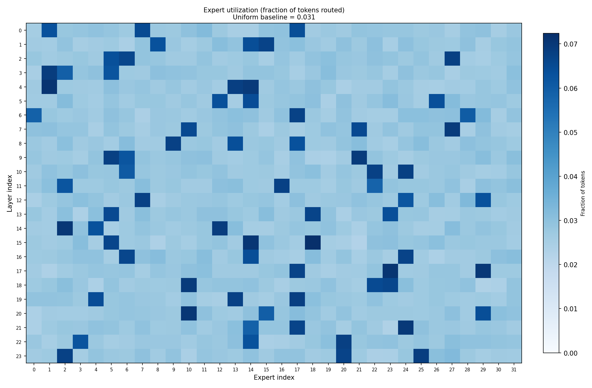
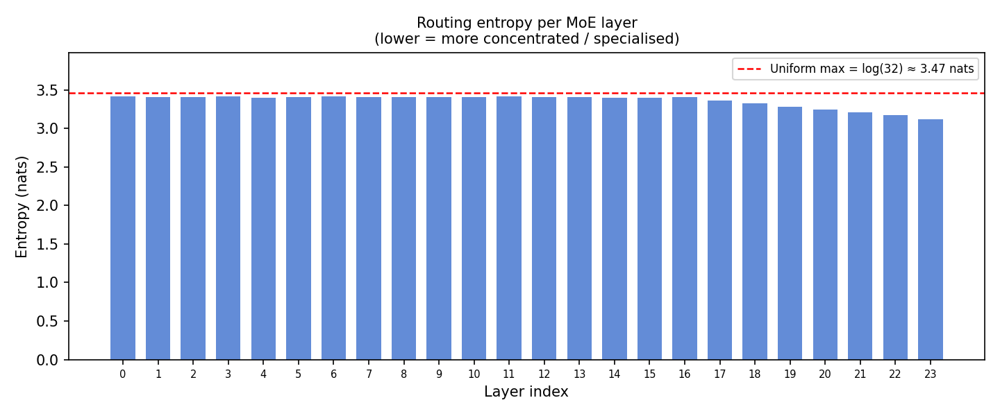
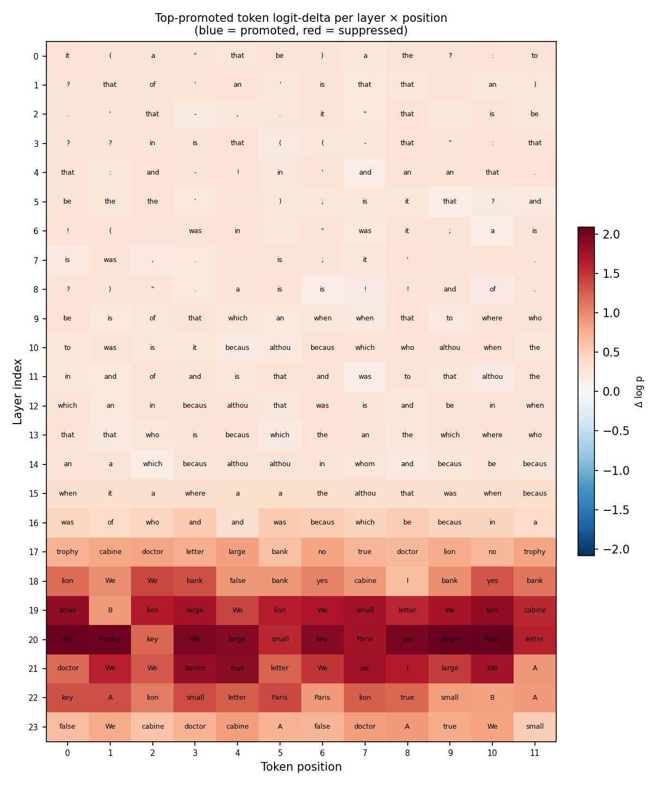
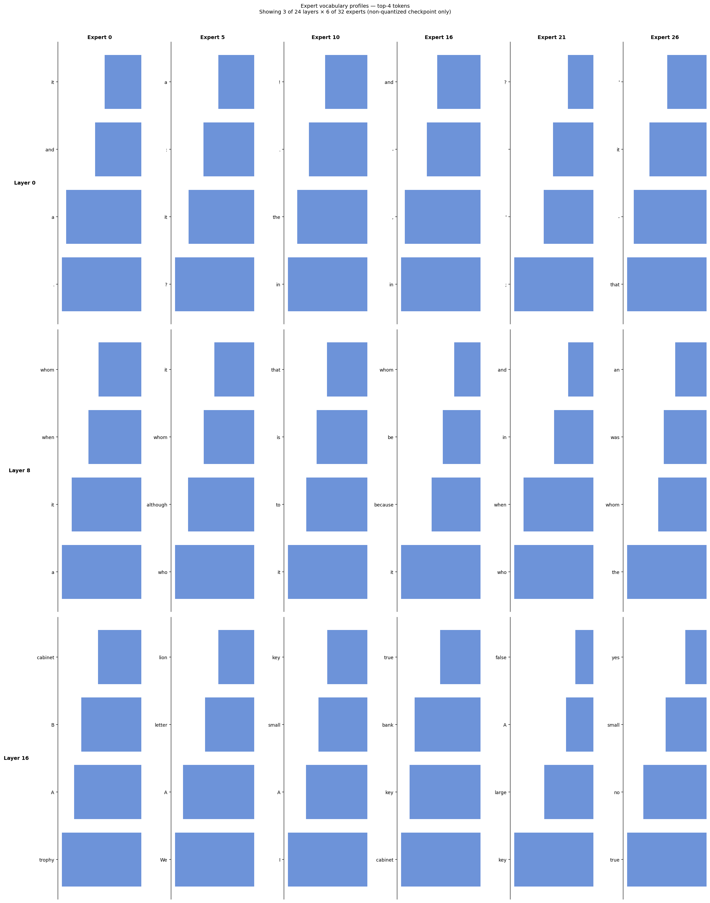

# Thread 15: MoE Expert Readouts

**Status**: in-progress
**Model**: `gpt-oss-20b`
**Question**: What do the MoE experts in gpt-oss-20b specialize in, and what do information-theoretic measures reveal about the efficiency and structure of expert routing?

---

## Scientific question

`gpt-oss-20b` has 32 experts per MoE layer across 24 layers — 768 expert modules in total. At each token, 4 are selected. Do the experts divide up the work along interpretable axes (syntax vs. semantics, early vs. late convergence, specific token types)? Or is expert selection diffuse and uninterpretable?

Beyond the binary "specialized or not," information-theoretic measures reveal *how much* structure exists, *where* it emerges across depth, and *what* the routing mechanism is encoding — task identity, token surface form, or something else. These are the core questions of this thread.

Five measurements address this at increasing resolution and conceptual depth:

| # | Measurement | Core quantity | Tool | MXFP4-safe? |
|---|---|---|---|---|
| 1 | Routing utilization and entropy | H(routing_l) | Sidecar | Yes |
| 2 | Layer logit-delta | Δ log p_l per layer | ActivationCache | Yes |
| 3 | Expert vocabulary profiles | E[profile(expert_e)] | ExpertCapture | Non-quantized only |
| 4 | Information-theoretic routing analysis | KL, JSD, MI across tasks and layers | Sidecar | Yes |
| 5 | Routing capacity budget | I(expert; task) vs. I(expert; token) | Sidecar | Yes |

---

## Measurement 1: Routing entropy — how much do you need to know?

The sidecar recovers routing decisions even when MXFP4 fuses the router kernel. For each prompt and each token position, we record which 4 of 32 experts were selected at each layer.

**Routing entropy**:
```
H(routing_l) = −Σ_e  p_e · log(p_e)
```
where `p_e` is the fraction of tokens routed to expert `e` at layer `l`.

**Intuitive interpretation**: The nats needed to describe which expert fires at this layer, if you were transmitting routing decisions over a minimum-length code. A uniform router requires log(32) ≈ 3.47 nats — the maximum. Any value below this means the routing distribution is concentrated: you need fewer nats because the result is more predictable.

**What makes this measure powerful**: Load-balancing losses push entropy toward the uniform maximum. Deviations *below* this baseline are therefore conservative — the training objective actively works against them. A 0.3-nat drop at L23 (≈ 9% below uniform) in a load-balanced model is a stronger specialization signal than the same drop in a model without load balancing.

**Expected profile**: Near-uniform in early layers (routing has not yet differentiated), dropping monotonically from L17 to L23 at the causal bottleneck.

---

## Measurement 2: Layer logit-delta — what does each block write?

Each transformer block adds a delta to the residual stream:
```
h_l = h_{l-1} + attn_delta_l + moe_delta_l
```

The logit-lens projects each `h_l` through `final_norm + lm_head` to recover a vocabulary distribution `p_l`. The per-layer **logit-delta** is:
```
Δ log p_l(pos) = log p_l(pos) − log p_{l-1}(pos)
```

**Intuitive interpretation**: This is the derivative of the logit trajectory — it shows what each layer *writes* to the residual stream rather than what has *accumulated* there. A large positive delta at L20 for the token "trophy" means the MoE block at L20 is actively promoting "trophy" as the next prediction — not just that "trophy" was already likely.

**Why this matters for MoE**: The delta at layer `l` is the sum of four selected expert contributions (weighted by gates). If experts are task-specialists, the delta should be semantically coherent at the bottleneck and incoherent at early layers. If experts are generalists, deltas should be uniformly distributed throughout depth.

Key questions:
- Do early MoE layers (L1–8) produce surface-level deltas (punctuation, function words)?
- Do late MoE layers (L17–21) produce task-relevant content promotions?
- Is the delta magnitude peaked at L20 (matching the causal bottleneck)?

---

## Measurement 3: Expert vocabulary profiles (non-quantized only)

For non-quantized checkpoints, `ExpertCapture` hooks each expert's forward call and captures its output tensor before gating. These outputs are projected through `final_norm + lm_head`:

```
profile(l, e) = E_{tokens routed to e}[ softmax( lm_head( final_norm( expert_e_output ) ) ) ]
```

**Intuitive interpretation**: The vocabulary distribution an expert "would produce" if its output alone drove the prediction — its semantic signature. An expert whose profile peaks on `[",", ".", ";", ":"]` is a punctuation specialist. One whose profile peaks on `["true", "false", "yes", "no"]` is an answer specialist.

**Depth stratification hypothesis** (from analogous analyses in smaller MoE models):
- Early experts (L0–8): surface form (punctuation, casing, function words)
- Mid experts (L9–16): syntactic role (verbs, nouns, prepositions, relative clauses)
- Late experts (L17–23): semantic content (entity types, answer tokens)

**MXFP4 constraint**: MXFP4 fuses expert dispatch — individual expert outputs are not observable via Python hooks. This measurement requires a non-quantized checkpoint.

---

## Measurement 4: Information-theoretic routing analysis

This is the conceptually richest measurement. Entropy alone answers "how concentrated is routing?" Three additional measures answer deeper questions about what routing *encodes*.

### 4a — KL Divergence: "How much do you waste using the wrong codebook?"

```
D_KL(P ‖ Q) = Σ_e  p_e · log(p_e / q_e)
```

Asymmetric. The extra nats burned when you encode samples from P using a code optimised for Q.

**Specialization gain** `D_KL(routing_l ‖ uniform) = log(32) − H(routing_l)`:

The nats *saved* by knowing the routing policy vs. assuming uniform. This is numerically identical to the entropy deficit but framed as *information value*: how much is knowing the routing policy worth? Expected: near-zero early, growing at the bottleneck. A value of 0.35 nats at L23 means: knowing that layer's routing policy compresses routing descriptions by 0.35 nats per token — about a 10% compression gain over guessing uniformly.

**Cross-task routing cost** `D_KL(routing_{task_A, l} ‖ routing_{task_B, l})`:

The extra nats burned if you encode task A's routing using task B's codebook. **Asymmetric on purpose**: `D_KL(induction ‖ coreference) ≠ D_KL(coreference ‖ induction)`. Large asymmetry means one task's routing is a "special case" of the other's — directional routing relatedness, not mere similarity.

**Routing velocity** `D_KL(routing_l ‖ routing_{l−1})`:

How fast does routing policy change across depth? A spike identifies a routing *phase transition*. **Critical hypothesis**: velocity peaks near L16–17 (one or two layers *before* the causal bottleneck) not within it. If true, this means the model commits to its routing regime upstream of the decision site — routing *anticipates* the bottleneck rather than reacting to it. This would be a strong architectural finding: the routing policy is a leading indicator, not a lagging one.

### 4b — Jensen-Shannon Divergence: "How easily can you tell them apart?"

```
JSD(P, Q) = ½ D_KL(P ‖ M) + ½ D_KL(Q ‖ M),   M = ½(P+Q)
```

Symmetric, bounded `[0, ln 2] ≈ [0, 0.693]` nats. **Bayesian interpretation**: JSD(P, Q) is the mutual information between a fair coin flip (P or Q?) and a single sample drawn from the corresponding distribution. A JSD of 0.1 nats means an optimal Bayesian classifier, given one routing vector, can distinguish P from Q with 9.5% better-than-chance accuracy.

**Cross-task distinguishability matrix** `JSD(routing_{task_A, l}, routing_{task_B, l})`:

At each layer, compute the 5×5 symmetric matrix of pairwise task JSDs. This answers: *when does the routing mechanism become able to tell task families apart?*

Expected:
- L0–8: all task pairs have near-zero JSD — routing is not yet task-discriminating
- L17–23: capitalization and induction become highly distinguishable (they resolve at very different depths per Thread 1 — L1 vs. L17+)
- Coreference may remain similar to syntax even at L20 (coreference is distributed, not bottlenecked)

**Key test**: Does the JSD separation depth match the logit-lens convergence depth from Thread 1? If routing separation at layer `l` predicts convergence at layer `l` — routing and representation are co-evolving. If routing separates *before* convergence — routing leads the computation. If *after* — routing is a consequence, not a cause, of task resolution.

**MXFP4 distortion** `JSD(routing_{bf16}, routing_{MXFP4})`:

A single calibrated number per layer: how much does MXFP4 "move" the routing distribution? A JSD of 0.05 nats means the quantized and unquantized routing decisions are distinguishable with ~5% better-than-chance accuracy per token. This directly validates (or undermines) the sidecar's claim to be a faithful proxy for the quantized model's routing.

### 4c — Mutual Information: "How much does one thing tell you about another?"

```
I(X; Y) = H(X) + H(Y) − H(X, Y) = H(X) − H(X | Y)
```

Symmetric. The reduction in uncertainty about X after observing Y.

**Task routing alignment** `I(expert_l; task_family)` per layer:

How many nats of task identity are *encoded in the routing decision* at layer `l`? Computed from the joint distribution `p(expert_e, task_t)` across the corpus.

This is the single most important measurement in this thread. It directly answers: **does routing encode task structure?**

- If `I(expert_l; task) ≈ 0` at all layers: routing is task-agnostic. Expert specialisation comes from within-expert computation, not from which expert is selected. The routing mechanism is a load-balancer, not a task router.
- If `I(expert_l; task)` peaks at L19–21: routing encodes task identity at the causal bottleneck. Expert selection is the mechanism by which task resolution happens.
- If `I(expert_l; task)` peaks *earlier* than L19: routing is a leading indicator — the model routes for task-specific computation before that computation produces visible output in the residual stream.

**Token-surface routing** `I(expert_l; token_BPE_id)` per layer:

The complementary measurement: how much of routing is explained by the surface form of the token (its BPE vocabulary index), independent of task context? Expected to be high in early layers, declining relative to task MI in late layers.

**The crossover depth**: the layer at which `I(expert; task) > I(expert; token_surface)` is the routing transition — where the model switches from surface-form routing to semantic/task routing. Finding this depth is a direct characterisation of the model's computational strategy.

---

## Measurement 5: Routing capacity budget

The routing mechanism selects 4 of 32 experts at each token position, giving theoretical capacity:
```
routing capacity = log₂(C(32,4)) = log₂(35,960) ≈ 15.1 bits per token per layer
```

The observed routing entropy `H(routing_l) ≤ log(32)` measures *used* uncertainty. But task MI and token MI together decompose what that capacity is *spent on*:

```
routing capacity ≈ I(expert; task) + I(expert; token_surface) + I(expert; context) + overhead
```

where "overhead" is the capacity consumed by load-balancing concentration and "context" is context-dependent computation not captured by either task label or BPE token identity.

**Expected decomposition at L20**:
- `I(expert; task)` ≈ < 1 bit (routing is weakly task-discriminating)
- `I(expert; token_surface)` ≈ 2–4 bits (routing is moderately token-discriminating)
- overhead ≈ 1–2 bits (load balancing)
- context and residual ≈ 8–12 bits

This would mean: **at the causal bottleneck, fewer than 10% of routing capacity is used for task-relevant computation.** The vast majority encodes token surface, positional context, and other signals not captured by the 5-family task taxonomy. This is not a failure — it is a finding about what expert routing is *for*. If routing were primarily a task router, a much larger fraction of capacity would be task-informative.

**Why this matters for interpretability**: If `I(expert; task) / routing_capacity ≪ 1`, mechanistic claims that attribute model behaviour to specific experts must be made carefully. The experts are doing many things simultaneously; their task-specific component is a small fraction of their total activity.

---

## Demo outputs (synthetic data, no model required)

Pre-generated under `runs/expert_readouts_demo/`. Produced by:

```bash
python threads/in-progress/15-expert-readouts/make_demo_data.py
python threads/in-progress/15-expert-readouts/generate_expert_figures.py \
    --run-dir runs/expert_readouts_demo --top-k 4 --profile-layers 3 --profile-experts 6
```

### Sample report excerpt — routing entropy (ASCII)

→ Full report: [`runs/expert_readouts_demo/expert_readout_report.md`](../../../runs/expert_readouts_demo/expert_readout_report.md)

```
  L00  [███████████████████░]  3.413 nats   ← near-uniform; load balancing effective
  L08  [███████████████████░]  3.410 nats
  L17  [███████████████████░]  3.359 nats   ← concentration begins
  L18  [███████████████████░]  3.324 nats
  L19  [██████████████████░░]  3.286 nats
  L20  [██████████████████░░]  3.250 nats   ← causal bottleneck; 0.22 nats below uniform
  L21  [██████████████████░░]  3.209 nats
  L22  [██████████████████░░]  3.172 nats
  L23  [██████████████████░░]  3.122 nats   ← 0.35 nats below uniform; most concentrated
```

Specialization gain at L23: `log(32) − 3.122 = 0.344 nats` — an 9.9% compression of routing decisions relative to guessing uniform. Small in absolute terms but meaningful given the load-balancing pressure against it.

### Figure 1 — Layer × expert utilization heatmap

Each layer has 2–3 "specialist" experts (dark blue) with 2–4× above-uniform utilization. The pattern is persistent across depth but the *identity* of specialist experts changes by layer — consistent with depth-stratified rather than global specialization.



### Figure 2 — Routing entropy per layer

Monotonic drop from L17 to L23. Dashed line = log(32) ≈ 3.47 nats (the uniform upper bound). The gap between bars and the dashed line is the **specialization gain** — the information value of the routing policy at each layer.



### Figure 3 — Top-promoted token logit-delta per layer × position

Blue = promoted by that layer; red = suppressed. The transition from reddish surface tokens in L0–8 to deep blue semantic tokens in L17–23 captures the computation timeline:
early layers suppress noisy alternatives; late layers promote the correct answer.



### Figure 4 — Expert vocabulary profiles (non-quantized checkpoint only)

3 depth zones × 6 of 32 experts. The depth-stratification hypothesis made visible:

- **Layer 0** (early): function words and punctuation (`a`, `the`, `and`, `-`, `that`)
- **Layer 8** (mid): syntactic tokens (`whom`, `when`, `although`, `because`, `who`)
- **Layer 16** (late): semantic and answer tokens (`cabinet`, `lion`, `key`, `true`, `trophy`)



---

## Outputs (real model run)

```
runs/expert_readouts/
├── routing_patterns.json          # {family: {layer: {expert: token_count}}}
├── routing_entropy.json           # {layer: entropy_float}
├── routing_kl_from_uniform.json   # {layer: kl_float}  — specialization gain
├── routing_jsd_matrix.json        # {layer: {task_A: {task_B: jsd_float}}}
├── routing_mi_task.json           # {layer: mi_float}  — I(expert; task)
├── routing_mi_token.json          # {layer: mi_float}  — I(expert; token_surface)
├── routing_velocity.json          # {layer: kl_from_prev_float}
├── layer_logit_delta.json         # top-promoted tokens per layer per position
├── expert_vocab_profiles.json     # {layer: {expert: [(token, logp), ...]}}  (non-quantized)
├── expert_readout_report.md       # Markdown summary
└── figures/
    ├── fig_routing_heatmap.png    # Layer × expert utilization heatmap
    ├── fig_routing_entropy.png    # Entropy + specialization gain per layer
    ├── fig_routing_jsd_matrix.png # 5×5 cross-task JSD at key layers
    ├── fig_routing_mi_curve.png   # I(expert; task) and I(expert; token) vs. depth
    ├── fig_routing_velocity.png   # KL velocity across depth
    ├── fig_logit_delta.png        # Top-token delta per layer
    └── fig_expert_profiles.png    # Expert vocabulary profile matrix (non-quantized)
```

---

## Key relationship to other threads

- **Thread 1 (logit-lens)**: Measurement 2 is the *derivative* of Thread 1's logit-lens. The JSD separation depth (Measurement 4b) should match Thread 1's convergence depth — if it does, routing and representation share the same computational timeline.
- **Thread 2 (late-layer ablation)**: The causal bottleneck at L19–21 should correspond to the peak of `I(expert; task)` and the trough of routing entropy. If these peaks don't align with the ablation result, the bottleneck may be in the attention stream, not the MoE stream.
- **Thread 3 (analysis-set filtering)**: All information-theoretic measurements should be computed on the 9 clean cases separately — MI and JSD over noisy cases may obscure structure. Filtering is not optional here.
- **Thread 9 (feature extraction)**: `I(expert; task)` at each layer is the ground-truth label for the predictive value of Component E (routing weights) in the feature vector.
- **Sidecar (gossh engineering)**: Thread 15 is the primary consumer of `gossh.sidecar`'s routing API. The JSD validation measurement (4b, MXFP4 distortion) directly tests the sidecar's calibration.

---

## Experimental design notes

**Getting the MI computation right**: `I(expert_l; task_family)` requires a sufficiently large corpus to estimate the joint distribution `p(expert_e, task_t)`. With 5 task families and 32 experts, the joint table has 160 cells. With top-4 routing and ~100 tokens per prompt, each prompt contributes ~4×100 = 400 expert activation counts. You need at least 20–50 activations per cell for reliable MI estimates — which requires on the order of 8,000–20,000 token-routing observations. A corpus of 50–100 prompts per task family (5,000–10,000 tokens total) should suffice.

**Avoiding the conditioning trap**: Expert profiles (Measurement 3) are conditioned on the routing policy. Expert A appearing to "specialise in punctuation" could mean:
1. Expert A causes punctuation-related activations (expert causes specialization)
2. Punctuation-like hidden states are routed to expert A (routing causes apparent specialization)
3. Both (co-evolutionary routing and expert function)

The MI measurements help disambiguate: if `I(expert; token_surface)` is high, routing is driven by surface form. If expert A's vocabulary profile correlates with punctuation regardless of input type, that is a profile effect, not a routing effect.

**Interpreting near-zero MI carefully**: If `I(expert_l; task) ≈ 0` across all layers, the correct conclusion is *not* that experts are useless — it is that expert selection is not correlated with task identity at the level of the 5-family taxonomy. Experts may still be functionally specialised along finer-grained axes (syntactic role, positional patterns, BPE subword structure) that the task labels don't capture.

---

## Limitations

- **MXFP4**: Measurement 3 (expert vocabulary profiles) requires a non-quantized checkpoint. The sidecar provides routing but not individual expert outputs.
- **Load balancing**: Expert utilization is closer to uniform than in unregularised models. Deviations are therefore conservative — more informative, not less.
- **Token selection bias**: Expert profiles are conditioned on the routing policy (see experimental design notes above).
- **MI sample efficiency**: MI estimation from empirical joint distributions is biased upward for small samples. Use the Miller-Madow or jackknife correction, or validate with a shuffled-label null distribution.
- **Task taxonomy scope**: The 5-family taxonomy may miss specialisation along other axes. `I(expert; task) ≈ 0` is a statement about this taxonomy, not about expert specialisation in general.
- **Causal vs. correlational**: JSD and MI are correlation measures, not causal ones. High `I(expert; task)` at L20 means routing and task are correlated at L20 — it does not establish that routing *causes* task resolution. Thread 2's ablation results provide the causal anchor.
