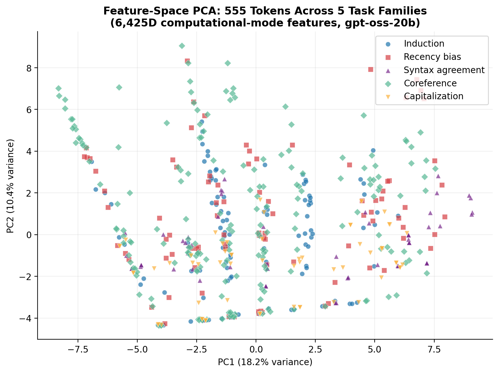

# Thread 9: Feature Extraction

**Status**: In progress — **Objective**: Measure computational modes

## Problem
Individual interpretability readouts — logit lens, attention patterns, expert routing weights — each capture one slice of what a model is doing. But interpreting a model requires combining these signals: a token might have high expert-3 activation *and* late convergence *and* a specific attention pattern, and it's the combination that defines the computational mode. Constructing a unified feature vector that captures all of these signals simultaneously enables clustering, dimensionality reduction, and geometric analysis that would be impossible on any single readout.

## Why it matters
If computational modes form distinct clusters in a high-dimensional feature space, that's direct evidence of structured computation — the model is doing categorically different things for different inputs, not computing on a smooth continuum. This connects interpretability to the representation learning literature and provides a quantitative foundation for claims like "the model handles induction differently from coreference." The feature space is also a prerequisite for the geometric framework (thread 12), which uses it for cross-model comparison.

## Contribution
The extended Tier-2 feature system is **adapted from the companion PLS preprint's** activation clustering methodology, extended for MoE architectures. The original PLS feature vector captures attention and residual-stream signals; this adaptation adds expert routing weights and MoE-specific features to produce ~7,200-dimensional vectors. The adaptation to MoE is a modest extension of prior work. This thread is in progress — the code exists but has only been exercised on 12 tokens across 3 runs, far too thin for the geometric analysis it was designed to support.

## Scripts
- `run_feature_extraction.py` — extended Tier-2 feature extraction (~7,200D for MoE)

## Runs (in `runs/`)
- `features_induction/`
- `features_recency/`
- `features_syntax/`

## Figures (in `figures/`)
- `fig8_feature_pca.{pdf,png}`

## Preliminary results

PCA of 555 tokens across 5 task families in the 6,425D feature space shows partial but incomplete task-family clustering. PC1 (18.2%) and PC2 (10.4%) together capture less than 30% of variance — the feature space is genuinely high-dimensional with intrinsic dimension 20–68 depending on task family. Capitalization clusters tightly near the center; coreference spreads widely; induction and recency overlap substantially. This is consistent with the expectation that computational modes are not simply task labels but reflect finer-grained processing distinctions.

### Per-task geometric analysis

| Task | Tokens | Feature dims | Intrinsic dim (90% var) | Depth stratification |
|------|-------:|-------------:|------------------------:|---------------------:|
| Induction | 114 | 6,425 | 41 | 0.390 |
| Recency bias | 93 | 6,425 | 38 | 0.530 |
| Syntax agreement | 81 | 6,425 | 20 | 0.618 |
| Coreference | 194 | 6,425 | 68 | 0.434 |
| Capitalization | 73 | 6,425 | 24 | 0.495 |

Syntax agreement has the lowest intrinsic dimension (20) and highest depth stratification (0.618), suggesting the most structured computation. Coreference has the highest intrinsic dimension (68), consistent with it being the most distributed and hardest to decompose (see also thread 7, where coreference produces zero promoted channels).

## Current state
- Code is implemented (`features/extractor.py`: 477 lines, `features/geometry.py`: 239 lines)
- 5 families, 36 prompts, 555 tokens analyzed at 6,425D
- Geometric analysis reveals task-dependent intrinsic dimensionality (20–68)
- PCA shows partial task clustering but the feature space is high-dimensional — first 2 PCs capture < 30%

## Gaps
- Connection to downstream tasks (e.g., probing, steering) not yet demonstrated
- Nonlinear dimensionality reduction (t-SNE, UMAP) may reveal structure PCA misses
- Cross-model comparison (thread 12) not yet attempted

## Package dependencies
`features.extractor`, `features.geometry`, `capture.activation_cache`, `backends.transformers_gpt_oss`

## Related threads
- [12-geometric-framework](../../theoretical/12-geometric-framework/) — theoretical basis for feature-space analysis
- [1-convergence-logit-lens](../../solid/1-convergence-logit-lens/) — simpler per-layer readouts
