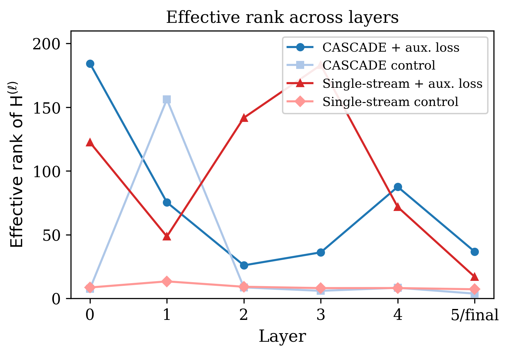
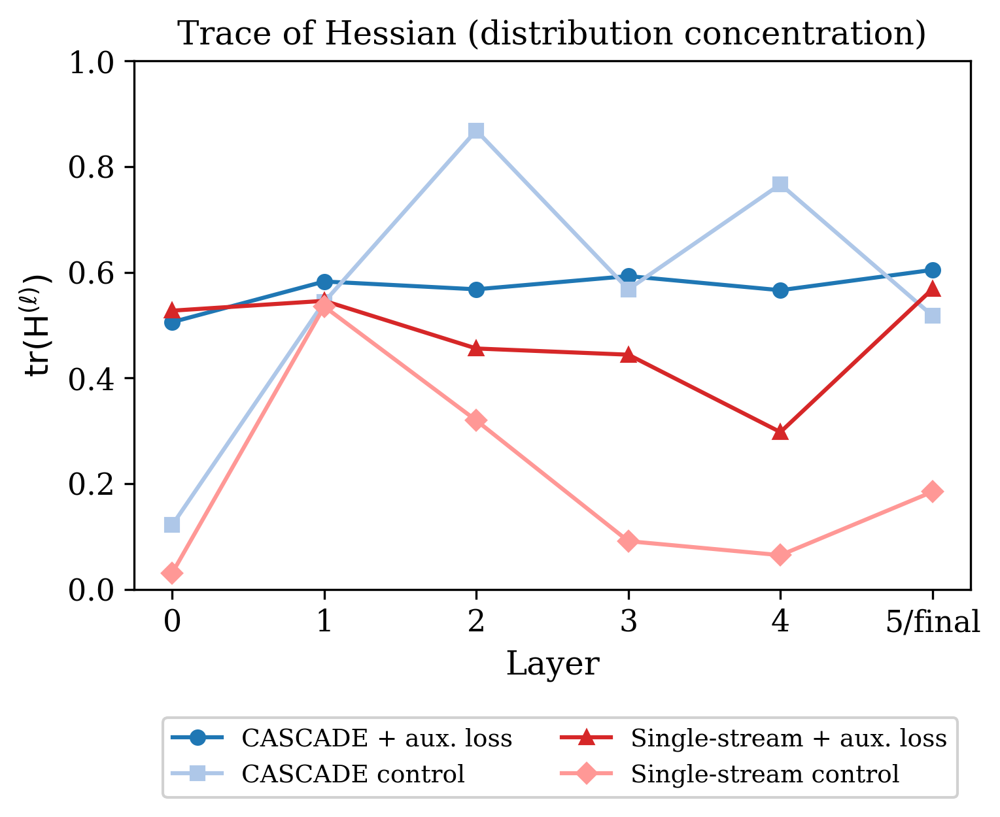
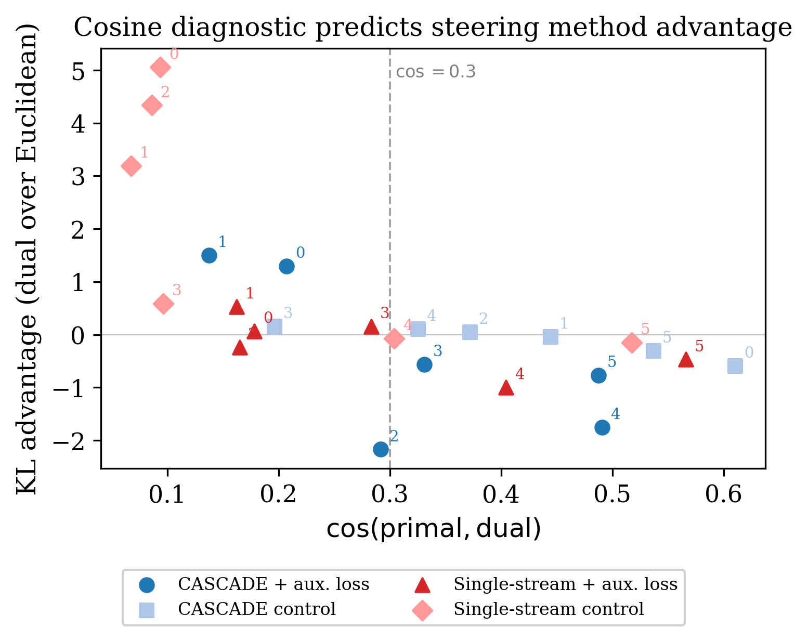

# Thread 14: Bregman Geometry

**Status**: Solid — **Objective**: Measure geometric prerequisites for linear intervention
**Model**: Four matched 45.4M-parameter transformers in a 2x2 factorial design (stream separation x per-layer supervision), all with GPT-2 tokenizer (50K vocab), 6 layers, 6 heads, 516-dimensional embeddings, and gated attention. These are companion models from the DST preprint series, not gpt-oss-20b.

## Problem
Probing, activation engineering, and concept erasure are linear methods. They identify a direction in representation space and add, remove, or read off a signal along that direction. Each method assumes that moving along a straight line in representation space produces a predictable change in the output distribution. This holds when the geometry is flat. It can fail when the geometry is curved.

Park et al. (2026) showed that softmax induces a curved Bregman geometry whose metric tensor is the Hessian of the log-normalizer, H(λ) = Cov[γ | λ]. When H is well-conditioned, primal directions (straight lines in logit space) approximate dual directions (geodesics under the Bregman metric), and linear steering works. When H is poorly conditioned, primal and dual directions diverge, and Euclidean steering leaks probability mass to unintended tokens. Their analysis applies at the output layer. The question is: what happens at intermediate layers, where linear safety interventions are increasingly applied?

## Why it matters
Every linear interpretability method used in this project — the logit lens (thread 1), direct vocabulary steering (thread 6), channel-level intervention (thread 7), selectivity measurement (thread 8) — implicitly assumes that the geometry at the intervention layer is well-behaved. If the Hessian at an intermediate layer is degenerate, a steering vector that appears to work (the probe reads the intended signal) can silently redistribute probability mass to unintended tokens. The intervention appears correct in the Euclidean sense while failing in the geometric sense. This is a verifiable failure mode, not a theoretical concern.

The practical consequence is that architecture choice determines whether linear safety interventions can be trusted. A safety-critical steering vector applied at a geometrically degenerate layer may not produce the intended behavioral change, or may produce it while simultaneously disturbing the output distribution in uncontrolled ways. This thread provides a cheap diagnostic to detect the problem before deployment.

## Contribution
This thread extends Park et al.'s output-layer Bregman analysis to **intermediate transformer layers**, providing the first measurement of how Hessian conditioning varies with depth and architecture. The 2x2 factorial design (stream separation x per-layer supervision) isolates the contribution of each intervention. The cosine diagnostic (primal-dual cosine similarity as a predictor of steering validity) is an **original practical tool** for practitioners deciding where to apply linear interventions. The finding that architecture dominates training objective as a determinant of geometric conditioning has not been established in prior work.

## Scripts
- `generate_bregman_figures.py` — generates effective rank, cosine diagnostic, and trace figures

## Figures (in `figures/`)
- `fig9_effective_rank.{pdf,png}`
- `fig10_cosine_diagnostic.{pdf,png}`
- `fig11_trace.{pdf,png}`

## Results

### Illustrative example — when does linear steering break?

Consider steering a model to shift a gendered pronoun. You compute the direction `W["she"] - W["he"]` and add it to the hidden state at some layer. Two things can happen:

> **At a well-conditioned layer** (e.g., CASCADE model, any layer):
> - cos(primal, dual) = 0.61. The straight-line direction you computed approximates the natural gradient direction under the Bregman metric.
> - Adding the direction shifts probability from "he" to "she" as intended.
> - Off-target KL divergence is small: the rest of the output distribution is barely disturbed.
> - The intervention does what you think it does.
>
> **At a degenerate layer** (e.g., single-stream control, layer 0):
> - cos(primal, dual) = 0.09. The straight-line direction you computed points almost orthogonally to the natural gradient direction.
> - Adding the direction still moves *some* probability toward "she" — but it simultaneously leaks probability mass to unintended tokens.
> - Off-target KL divergence is +5.1 higher than it would be with dual steering.
> - The intervention appears to work if you only check the target token, but it silently corrupts the rest of the distribution.

The difference is not the steering direction — it's the geometry at the layer where you apply it. The same direction, applied at different layers, can be clean or destructive.

### How degenerate is the baseline?

The Hessian has 516 dimensions. In single-stream transformers without auxiliary supervision, the effective rank is 7–14 at every layer. Linear methods at these layers operate in roughly **2% of the geometry**.

| | CASCADE | | Single-stream | |
|-------|----------:|---------:|----------:|---------:|
| Layer | + aux. loss | control | + aux. loss | control |
| 0 | 184 | 8 | 123 | 9 |
| 1 | 75 | 156 | 49 | 14 |
| 2 | 26 | 9 | 142 | 9 |
| 3 | 36 | 6 | 183 | 8 |
| 4 | 88 | 8 | 72 | 8 |
| 5/final | 37 | 4 | 17 | 7 |

### What fixes the geometry?

Stream separation improves conditioning by up to **22x** in effective rank, even without auxiliary supervision. The frozen token stream anchors the coordinate system to the embedding space at every layer, preventing the cumulative coordinate distortion that makes intermediate-layer Hessians degenerate.

Per-layer supervision (vocabulary decoding loss at each layer) also improves conditioning, but less. It adds gradient signal encouraging each layer's representations to be useful for prediction, but the architecture still permits the representation to drift between loss computations.

The key comparison: CASCADE control (no auxiliary loss) produces better geometry than single-stream with auxiliary loss at layers 4–5 and final. **Architecture, not training objective, is the primary determinant of geometric conditioning.**

### Distribution concentration explains why deep layers are less affected

The trace of H (total variance of the softmax distribution) measures how much probability mass is available to steer. In single-stream models, the trace collapses from 0.5 at layer 0 to 0.03–0.06 at layers 3–5: the softmax distribution concentrates on a few tokens early in the network, leaving little probability mass to misallocate. CASCADE models maintain traces of 0.4–0.7 throughout. This concentration effect means that at the deepest layers, both good and bad geometry lead to similar steering outcomes — not because the geometry is fine, but because there is nothing left to steer.

### The cosine diagnostic

The cosine similarity between the primal concept direction and the corresponding dual direction predicts whether Euclidean steering is reliable at a given layer:

| Regime | cos(primal, dual) | Steering validity |
|--------|------------------:|-------------------|
| Unreliable | < 0.3 | Euclidean steering leaks probability mass; dual steering required |
| Ambiguous | 0.3–0.4 | Transition zone |
| Reliable | > 0.4 | Primal approximates dual; Euclidean steering works |

This pattern holds across all four models and all layers. The diagnostic requires one eigendecomposition of H — it can be computed before choosing a steering method or layer, without running any steering experiment.

### KL advantage of dual over Euclidean steering

Positive values mean Euclidean steering causes unnecessary side effects that dual steering avoids:

| | CASCADE | | Single-stream | |
|-------|----------:|---------:|----------:|---------:|
| Layer | + aux. loss | control | + aux. loss | control |
| 0 | +1.29 | -0.59 | +0.07 | **+5.05** |
| 1 | +1.51 | -0.05 | +0.53 | **+3.19** |
| 2 | -2.17 | +0.04 | -0.24 | **+4.34** |
| 3 | -0.56 | +0.15 | +0.16 | +0.59 |
| 4 | -1.75 | +0.11 | -1.00 | -0.07 |
| 5/final | -0.76 | -0.31 | -0.47 | -0.15 |

In the single-stream control model, dual steering outperforms Euclidean at layers 0–3 by +0.6 to +5.1 KL. These are the layers where the Hessian is degenerate (effective rank 8–14). In CASCADE models, the advantage largely vanishes — the geometry is well-conditioned enough that the simpler Euclidean method works.

### Downstream validation

The cosine diagnostic predicts steering effectiveness on four downstream tasks (coreference, induction, recency, capitalization) using layer x scale sweeps across six step sizes:
- At layers 4–5, where cos > 0.3 in the single-stream model, steering effects are clean and sign-correct
- At layers 0–2, where cos < 0.1 in the single-stream model, effects are weaker, noisier, and occasionally sign-inconsistent
- CASCADE models show clean, sign-correct effects at all layers, consistent with cos > 0.4 throughout

## Key findings
- **Baseline degeneracy**: standard single-stream transformers have effective rank 8 in 516 dimensions at intermediate layers — linear methods operate in 2% of the geometry
- **Stream separation is the primary fix**: CASCADE improves conditioning by up to 22x, even without auxiliary supervision
- **Architecture dominates training objective**: CASCADE control has better geometry than single-stream with auxiliary loss
- **Cosine diagnostic**: cos(primal, dual) < 0.3 predicts Euclidean steering failure; > 0.4 predicts success — a cheap, pre-deployment check
- **Distribution concentration**: single-stream trace collapses to 0.03 at deep layers; CASCADE maintains 0.4–0.7
- **Coordinate rigidity conjecture**: stream separation improves conditioning by limiting cumulative coordinate distortion between layers — the frozen token stream anchors representations to the embedding-space coordinate system

## Limitations
- Models are small (45.4M parameters, 6 layers). Whether conditioning patterns persist at the scale of deployed language models is an open question.
- Steering evaluation uses gendered word pairs as the primary concept; downstream validation covers four tasks but does not include safety-specific evaluations (refusal, toxicity).
- The 0.3 cosine threshold is empirical and may shift with model scale or domain.

## Related threads
- [1-convergence-logit-lens](../1-convergence-logit-lens/) — the logit lens is a linear method whose validity depends on geometric conditioning
- [6-direct-vocab-steering](../6-direct-vocab-steering/) — `W[A]-W[B]` directions are primal directions; this thread explains when they approximate dual directions
- [7-channel-probing](../7-channel-probing/) — probe-causal dissociation may partly reflect geometric degeneracy at probe layers
- [8-selectivity](../8-selectivity/) — selectivity measurement assumes linear intervention geometry is well-behaved

## References

This thread extends the information-geometric framework of Park et al. to intermediate transformer layers, connecting geometric conditioning to the practical reliability of linear interpretability methods:

- [Park et al. 2026 — "The Information Geometry of Softmax: Probing and Steering"](../../../doc/references/papers/t14-park-information_geometry_softmax.pdf) — Proves that softmax induces a dually flat Bregman geometry and that dual steering is optimal at the output layer (their Theorem 3). Our contribution is extending this measurement inward: the Hessian at intermediate layers is severely degenerate in standard transformers, and architecture choice determines whether this degeneracy occurs.
- [Roy & Vetterli 2007 — "The Effective Rank"](../../../doc/references/papers/t14-roy-effective_rank.pdf) — Defines the entropy-based effective rank measure we use to quantify Hessian conditioning. Effective rank counts how many directions carry meaningful variance, making it more informative than the condition number alone for high-dimensional spaces where most eigenvalues are near-zero.
- [Frecon et al. 2022 — "Bregman Neural Networks"](../../../doc/references/papers/t14-frecon-bregman_neural_networks.pdf) — Studies Bregman divergences as activation functions in neural networks. Our work uses the Bregman structure that softmax induces on its inputs, following Park et al., rather than incorporating Bregman divergences into the network architecture.
- [Belrose et al. 2023 — "LEACE: Perfect Linear Concept Erasure in Closed Form"](../../../doc/references/papers/t14-belrose-leace.pdf) — Concept erasure removes directions to prevent models from representing sensitive attributes. LEACE operates linearly and assumes that the identified direction corresponds to a meaningful movement in output space — an assumption that fails when the Hessian is degenerate. Our cosine diagnostic identifies the layers where this assumption holds.
- [Alain & Bengio 2017 — "Understanding Intermediate Layers Using Linear Classifier Probes"](../../../doc/references/papers/t14-alain-linear_classifier_probes.pdf) — Establishes linear probing as a standard interpretability technique. Probes fit linear classifiers to hidden states, implicitly assuming Euclidean geometry. Our finding that intermediate-layer Hessians are degenerate (effective rank 2% of embedding dimension) suggests that probe accuracy at these layers may not reflect the model's actual computational structure.

The finding that architecture (stream separation) dominates training objective (auxiliary loss) as a determinant of geometric conditioning is consistent with the companion DST preprint's observation that architectural constraints produce more robust interpretability properties than training-time supervision alone.
