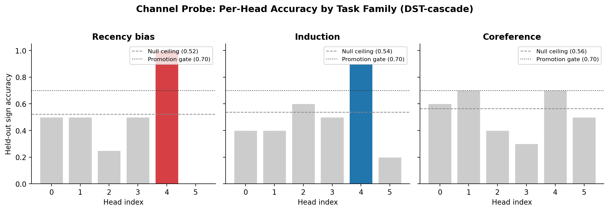

# Thread 7: Channel-Level Probing

**Status**: Solid — **Objective**: Resolve steering to channel level
**Model**: DST-cascade (companion 71M-parameter dual-stream model) — *not* gpt-oss-20b. Channel-level analysis requires architectural structure that isolates head contributions; gpt-oss-20b's extreme head redundancy (thread 5, σ = 0.042) makes per-channel decomposition uninformative at production scale without first breaking the Hydra effect.

## Problem
Thread 6 shows that steering works at the whole-vector level: adding a vocabulary-space direction to the full hidden state at the right layer and position flips model answers. But which dimensions of that hidden state are actually carrying the signal? A 4096-dimensional steering vector might have its effect concentrated in a handful of channels, or it might be diffusely spread across all of them. Knowing this determines whether the model has *sparse, interpretable features* at the channel level or whether meaning is encoded in a distributed, superposition-like manner within layers.

## Why it matters
Channel-level decomposition connects mechanistic interpretability to the superposition hypothesis (Elhage et al. 2022): if steering effects concentrate in a few channels, the model may have features that are more interpretable than the Hydra effect (thread 5) would suggest. If effects are distributed across hundreds of channels, that confirms the superposition picture and motivates dictionary-learning approaches. Either answer is informative. Per-channel causal analysis also provides a finer-grained intervention primitive — potentially enabling more selective steering with fewer off-target effects (see thread 8).

## Contribution
Per-channel causal intervention on steering directions is **original work** extending the whole-vector steering of thread 6. While per-neuron or per-feature probing is a well-established technique (Bau et al. 2018; Gurnee et al. 2023), applying it specifically to vocabulary-space steering directions in an MoE model and measuring per-channel causal effects is novel. Per-channel causal results on both recency and induction (DST-cascade) confirm the dissociation across task families.

## Scripts
- `run_channel_probe.py` — per-channel probing experiments
- `run_per_channel_causal.py` — per-channel causal intervention analysis

## Runs (in `runs/`)
- `channel_probe_c71_phase1/`, `channel_probe_smoke_c71/`
- `channel_probe_e2_phase1/`, `channel_probe_e2_smoke/`
- `channel_probe_ss71_phase1/`
- `per_channel_causal_e2_recency/`, `per_channel_causal_e2_recency_smoke/`

## Figures (in `figures/`)
- `fig6_channel_probe.{pdf,png}`

## Results

### Channel probe family summaries (DST-cascade model, phase 1)

| Task family | Cases | Promoted channels | Top channel | Top held-out accuracy | Null ceiling |
|-------------|------:|------------------:|:-----------:|----------------------:|-------------:|
| recency_bias | 4 | 6 | L0 H4 | 1.000 | 0.492 |
| induction | 10 | 6 | L5 H4 | 0.900 | 0.538 |
| coreference | 10 | 0 | L0 H4 | 0.700 | 0.527 |

All 12 promoted channels are head H4 across layers L0–L5, with identical accuracy within each task family. This consistency across layers is notable — it suggests H4 carries a task-relevant signal that is present from early layers, not computed in the critical late layers.

Coreference produces zero promoted channels (top accuracy 0.700 barely exceeds the null ceiling of 0.527), suggesting coreference information is more distributed across channels than recency or induction.

### Per-channel causal analysis — induction (DST-cascade)

Probe-promoted channels (H4) do not predict causal importance:

| Channel | Causal effect | Best scale | Probe accuracy | Promoted? |
|---------|-------------:|:----------:|---------------:|:---------:|
| L5 H5 | 2.852 | -8.0 | 0.200 | No |
| L5 H2 | 2.594 | -8.0 | 0.600 | No |
| L4 H2 | 1.879 | -8.0 | 0.600 | No |
| L5 H4 | 0.909 | -8.0 | 0.900 | Yes |

Spearman correlation between probe rank and causal rank: **-0.363**. The channels that best predict the answer sign (H4) are not the channels whose intervention most changes the output (H2, H5). This dissociation suggests that probing identifies readout-correlated channels, while causal intervention reveals channels that actively drive computation — these may be different.

### Per-channel causal analysis — recency (DST-cascade)

| Channel | Causal effect | Best scale | Probe accuracy | Promoted? |
|---------|-------------:|:----------:|---------------:|:---------:|
| L5 H5 | 1.450 | +8.0 | 0.000 | No |
| L5 H2 | 1.192 | -8.0 | 0.250 | No |
| L4 H5 | 0.918 | +8.0 | 0.000 | No |
| L5 H4 | 0.853 | -8.0 | 1.000 | Yes |

Spearman correlation between probe rank and causal rank: **-0.060** (near zero — uncorrelated).

### Cross-family causal comparison

| Family | Probe-causal Spearman | Top causal channel | Probe-promoted H4 rank | H4 causal effect |
|--------|----------------------:|:------------------:|:----------------------:|-----------------:|
| Recency | -0.060 | L5 H5 (1.450) | 6th (0.853) | Moderate |
| Induction | -0.363 | L5 H5 (2.852) | ~10th (0.909) | Weak |

The pattern is consistent across both families: **H5 is the top causal channel but is never probe-promoted** (probe accuracy 0.0–0.2). The probe consistently promotes H4 (accuracy 0.9–1.0), which has moderate-to-weak causal effect. Probing identifies readout-correlated channels; causal intervention identifies computation-driving channels — and these are systematically different.

The dissociation is stronger for induction (Spearman = -0.363) than recency (Spearman = -0.060), consistent with the selectivity finding ([thread 8](../8-selectivity/)) that induction steering is more distributed across channels than recency.

## Key findings
- **Probe-causal dissociation**: channels that best predict the answer (H4, probe accuracy 0.9–1.0) are not the channels that most change the output when intervened on (H2/H5)
- **Consistent across families**: pattern holds for both recency (Spearman = -0.060) and induction (Spearman = -0.363)
- **Coreference is too distributed**: zero promoted channels on both models — consistent with superposition hypothesis for this task
- **H5 is never probe-promoted but always causally dominant**: suggests a systematic separation between readout-correlated and computation-driving channels

## Limitations
- Coreference has zero promoted channels on both models — may require a different decomposition approach (e.g., dictionary learning)

## Package dependencies
`steering.probing`, `steering.causal`, `common.artifacts`, `common.io`

## Related threads
- [6-direct-vocab-steering](../../solid/6-direct-vocab-steering/) — whole-vector steering that this decomposes
- [8-selectivity](../8-selectivity/) — selectivity metrics confirm task-dependent channel concentration

## References

Per-channel probing connects to two traditions: neuron-level interpretability (identifying what individual units encode) and the superposition hypothesis (whether features are sparse or distributed):

- [Bau et al. 2018 — "GAN Dissection"](../../../doc/references/papers/t07-bau-gan_dissection.pdf) — Establishes the methodology of per-unit causal intervention: activating or suppressing individual neurons to test what they control. Our per-channel causal analysis applies this logic to attention head channels in the context of vocabulary steering.
- [Gurnee et al. 2023 — "Finding Neurons in a Haystack"](../../../doc/references/papers/t07-gurnee-finding_neurons_in_a_haystack.pdf) — Scales neuron-level probing to large language models, finding that some neurons encode interpretable features while most do not. Our probe-causal dissociation (H4 probes well but H2/H5 are causally important) is consistent with their finding that probing accuracy and causal importance are distinct properties.
- [Elhage et al. 2022 — "Toy Models of Superposition"](../../../doc/references/papers/t02-t05-t07-elhage-toy_models_of_superposition.pdf) — The superposition hypothesis predicts that features are distributed across neurons/channels rather than localized in individual units. Our finding that coreference has zero promoted channels while recency has 6 is consistent with task-dependent superposition: some computations are sparse enough to localize, others are not.
