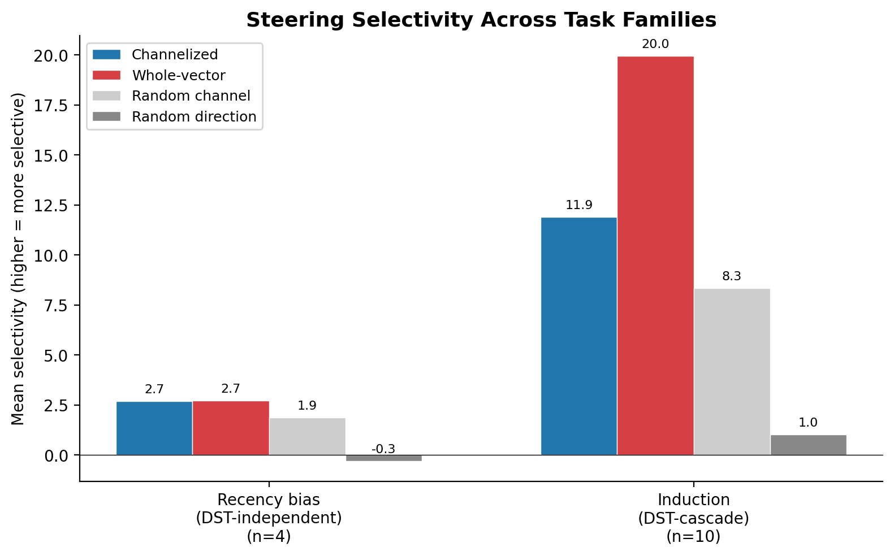

# Thread 8: Selectivity

**Status**: Solid — **Objective**: Measure steering specificity

## Problem
A steering intervention that flips the target answer (thread 6) is only useful if it doesn't simultaneously break everything else. If adding a `W["small"] - W["large"]` direction changes the answer from "large" to "small" but also degrades fluency, changes unrelated predictions, or shifts the model's confidence distribution on other tokens, the intervention isn't mechanistically clean — it's more like damage that happens to produce the desired side effect. Selectivity quantifies this: does the intervention affect *only* the intended behavior?

## Why it matters
Selectivity is the quality metric for steering. Without it, a 100% steering success rate is meaningless — the intervention might succeed by disrupting the model broadly rather than by engaging a specific circuit. High selectivity supports the mechanistic interpretation; low selectivity suggests the intervention is exploiting model fragility. This distinction matters both for interpretability (are we understanding real circuits?) and for potential applications (can we deploy targeted interventions without side effects?).

## Contribution
The selectivity comparison framework — measuring channelized vs whole-vector intervention effects across multiple metrics — is an **original evaluation methodology** developed in this project. Selectivity metrics exist in the broader ML fairness and robustness literatures, but the specific application to mechanistic steering interventions and the comparison between channel-level and whole-vector granularities is novel. Same-model (DST-cascade) comparison across recency and induction confirms task-dependent steering granularity.

## Scripts
- `run_selectivity_comparison.py` — compares channelized vs whole-vector selectivity

## Runs (in `runs/`)
- `selectivity_e2_recency/`
- `selectivity_e2_recency_full/`
- `selectivity_e2_recency_h5/`
- `selectivity_e2_recency_topheads/`

## Figures (in `figures/`)
- `fig7_selectivity_comparison.{pdf,png}`

## Results

### Recency bias (DST-independent, 4 LOO folds)

| Case | Channelized | Whole-vector | Random-channel | Random-direction | Channelized wins? |
|------|------------:|-------------:|---------------:|-----------------:|:-----------------:|
| recency_001 | 4.031 | 5.871 | 2.616 | 0.134 | No |
| recency_002 | 3.273 | 2.283 | 2.489 | -0.223 | Yes |
| recency_003 | 2.214 | 1.829 | 1.544 | -2.020 | Yes |
| recency_004 | 1.214 | 0.852 | 0.820 | 0.885 | Yes |
| **Mean** | **2.683** | **2.709** | — | — | **3/4** |

### Induction (DST-cascade, 10 LOO folds)

| Case | Channelized | Whole-vector | Random-channel | Random-direction | Channelized wins? |
|------|------------:|-------------:|---------------:|-----------------:|:-----------------:|
| induction_001 | 8.754 | 17.495 | 7.347 | 2.121 | No |
| induction_002 | 19.962 | 28.478 | 16.395 | 5.694 | No |
| induction_003 | 5.498 | 18.313 | 6.227 | 1.195 | No |
| induction_004 | 11.006 | 16.063 | 8.724 | 5.051 | No |
| induction_005 | 15.556 | 27.007 | 13.825 | 5.289 | No |
| induction_006 | 4.285 | 7.825 | 3.878 | 0.614 | No |
| induction_007 | 20.889 | 30.200 | 12.889 | 5.541 | No |
| induction_008 | 14.340 | 22.424 | 12.022 | 3.820 | No |
| induction_009 | 3.920 | 7.529 | 3.430 | 0.653 | No |
| induction_010 | 14.668 | 24.213 | 13.345 | 7.128 | Yes |
| **Mean** | **11.888** | **19.955** | — | — | **1/10** |

### Cross-family comparison

| Family | Model | Folds | Mean channelized | Mean whole-vector | Channelized wins | Channelized/whole ratio |
|--------|-------|------:|-----------------:|------------------:|-----------------:|------------------------:|
| Recency bias | DST-independent | 4 | 2.68 | 2.71 | 3/4 | 0.99 |
| Recency bias | DST-cascade | 4 | 9.94 | 12.45 | 1/4 | 0.80 |
| Induction | DST-cascade | 10 | 11.89 | 19.95 | 1/10 | 0.60 |

### Same-model comparison (DST-cascade)

The C-71 recency ratio (0.80) is lower than the E2 ratio (0.99), indicating some model dependence. But the key contrast holds on the same model: recency channelized/whole ratio (0.80) exceeds induction (0.60). The task-dependent signal concentration is not a model artifact.

Recency bias steering is more selective with a single channel relative to the full vector than induction steering. This is consistent with the probe-causal dissociation found in thread 7: recency has a weaker dissociation (Spearman = -0.060) while induction has a stronger one (Spearman = -0.363), suggesting recency's steering signal is more concentrated in identifiable channels.

This contrast has implications for interpretability methodology: **the right steering granularity is task-dependent**. Recency bias can be steered at the single-channel level with modest selectivity loss, suggesting a more localized mechanism. Induction requires coordinated intervention across multiple channels. A single interpretability approach — whether per-channel or whole-vector — will not be equally appropriate for all behaviors. This argues for task-aware intervention strategies rather than a one-size-fits-all methodology.

## Key findings
- **Task-dependent steering granularity**: recency channelized/whole ratio (0.80–0.99) far exceeds induction (0.60) — recency signal concentrates in few channels, induction is distributed
- **Consistent across models**: DST-independent (0.99) and DST-cascade (0.80) both show higher recency concentration than induction (0.60)
- **Random baselines confirm signal**: both channelized and whole-vector exceed random-channel and random-direction controls
- **Implication**: the right steering granularity is task-dependent — a single approach (per-channel or whole-vector) will not be equally appropriate for all behaviors

## Limitations
- Coreference selectivity remains untested — zero promoted channels on both models suggests the signal is too distributed for channelized analysis (consistent with thread 7's findings)

## Package dependencies
`steering.selectivity`, `steering.controls`, `steering.interventions`, `common.*`

## Related threads
- [6-direct-vocab-steering](../../solid/6-direct-vocab-steering/) — the interventions being evaluated
- [7-channel-probing](../7-channel-probing/) — probe-causal dissociation explains why selectivity differs by task

## References

Selectivity — measuring whether an intervention affects only the intended behavior — is related to the broader question of intervention specificity in mechanistic interpretability:

- [Li et al. 2023 — "Inference-Time Intervention: Eliciting Truthful Answers from a Language Model"](../../../doc/references/papers/t08-li-inference_time_intervention.pdf) — Introduces targeted activation editing at specific heads during inference. Evaluates both target effect and off-target damage. Our selectivity metric formalizes this tradeoff as the ratio of on-target to off-target effects across task families.
- [Turner et al. 2023 — "Activation Addition"](../../../doc/references/papers/t06-turner-activation_addition.pdf) — Notes that activation steering can have unintended side effects but does not systematically measure selectivity. Our cross-family comparison (channelized ratio 0.99 on recency vs 0.60 on induction) provides quantitative evidence that selectivity is task-dependent.

The finding that steering granularity should be task-dependent — single-channel for concentrated signals, whole-vector for distributed ones — is not, to our knowledge, established in the prior literature.
